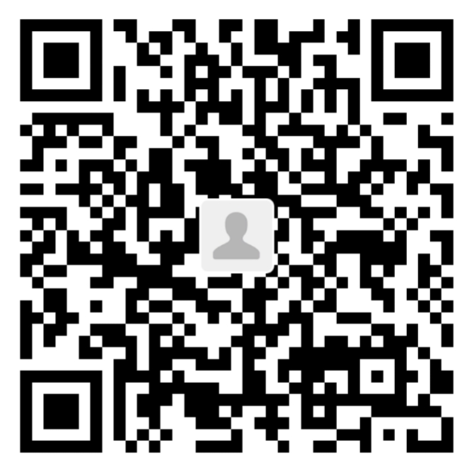

# 支持 MA CP 协议

感谢你对 MA CP 协议的兴趣与支持！作为一个由个人热情驱动的开源项目，你的每一笔赞助都是最直接的鼓励，它将帮助我确保有更多时间投入到核心协议开发、文档完善和生态建设中。

## 赞助方式

你可以通过以下任意一种方式扫码进行赞助。无论金额大小，我都致以最诚挚的感谢！

### 1. 微信支付
扫描下方的微信赞赏码，直接赞助。

[]

### 2. 支付宝
扫描下方的支付宝收钱码进行赞助。

[]

## 赞助意味着什么？
*   **对项目的直接投票**：你的赞助是对 **“多智能体协作”** 这一愿景最实在的认可，表明这个方向有价值、值得深入探索。
*   **可持续性的助力**：赞助将直接用于支持项目的**基础服务器开销、开发工具订阅**等，让项目能更稳定、专注地演进。
*   **精神上的巨大鼓舞**：这远不止一杯咖啡，它让我知道在这条孤独的探索之路上，有同行者看见并认可这份工作的价值。

## 心声
作为一名独立开发者，我选择将全部精力投入在完善协议本身、代码和文档上，以确保项目能扎实前进。因此，我可能无法为每位赞助者提供一对一的深度技术交流，还请谅解。

但你的名字（若你愿意）将被永久记录在项目的 [支持者列表](THANKS.md) 中，作为项目基石的一部分被铭记。

**感谢你以最纯粹的方式，支持一个纯粹的想法。**

—— 项目发起人
